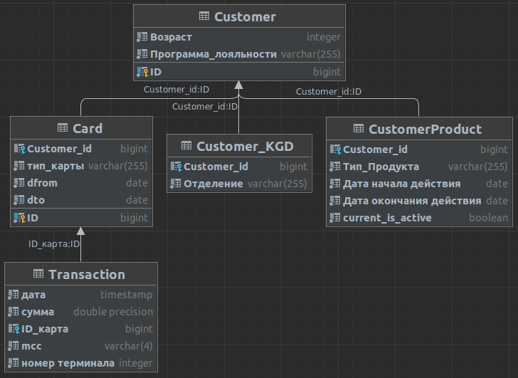

# Тестовое задание от Банка СПб

## Задания по SQL

Для выполнения задание была создана следующая структура таблиц:



Полный код с комментариями можно посмотреть [в файле](https://github.com/safonovpro/bspb/blob/master/docker/init/01_create_dbs.sql) или вывести в консоли находясь в папке проекта:

```shell
cat docker/init/01_create_dbs.sql
```
