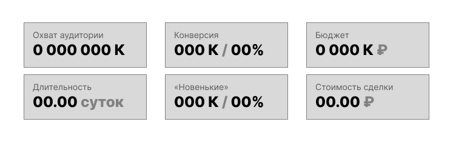
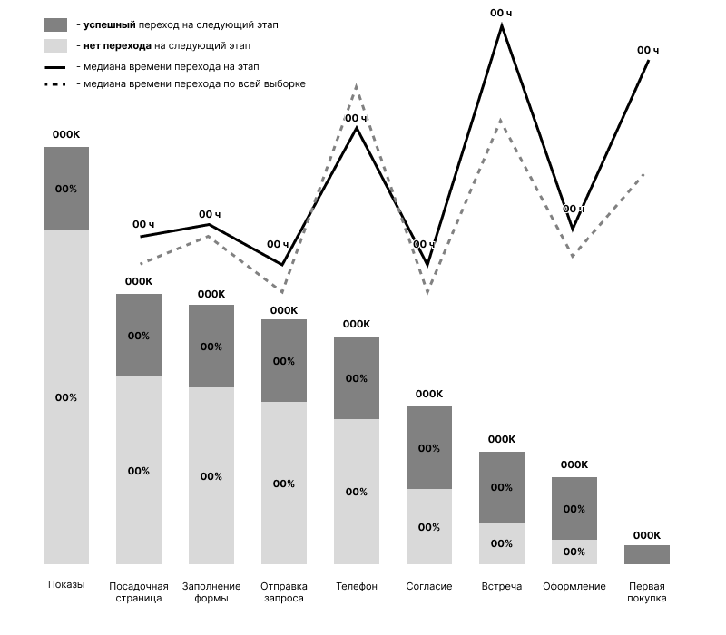
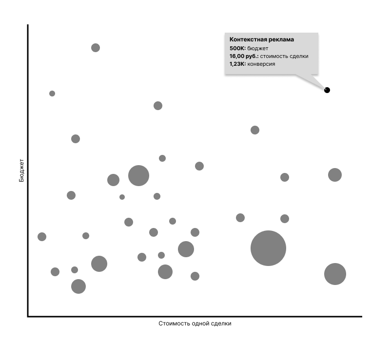

# Тестовое задание от Банка СПб

## Задания по SQL

При решении задач использовалась **СУБД PostgreSQL** 16 версии.

### Решения задач

1. Задача № 1:
   * [Задача № 1 (а)](https://github.com/safonovpro/bspb/blob/master/tasks/sql/task_01_a.sql)
   * [Задача № 1 (б)](https://github.com/safonovpro/bspb/blob/master/tasks/sql/task_01_b.sql)
2. [Задача № 2](https://github.com/safonovpro/bspb/blob/master/tasks/sql/task_02.sql)
3. [Задача № 3](https://github.com/safonovpro/bspb/blob/master/tasks/sql/task_03.sql) — **обратите внимание**, что есть вариативность трактовки данного задания, из-за этого может отличаться результат. Для решения задачи, чтобы приблизить окружение максимально к заданию [создано](https://github.com/safonovpro/bspb/blob/master/docker/init/07_create_view_agg_month.sql) представление `agg_month.Transaction`.

### Дополнительная информация по релизации

Для выполнения задание была создана следующая структура таблиц:


Полный код с комментариями можно посмотреть [в файле](https://github.com/safonovpro/bspb/blob/master/docker/init/01_create_dbs.sql) или вывести в консоли находясь в папке проекта:

```shell
cat docker/init/01_create_dbs.sql
```

К моему **глубокому сожалению** Вами не было предоставлено тестовых данных, поэтому большую часть времени я потратил именно на это. 
Код реализующий эту функцию можно изучить по [ссылке](https://github.com/safonovpro/bspb/blob/master/gen_fake_data.py). 
Всё реализовано с использованием стандартного функционала `python`, никаких доп. пакетов для воспроизведения не требуется. В папке проект необходимо выполнить:

```shell
python gen_fake_data.py
```

Скрипт генерирует следующий список файлов:

1. `docker/init/02_customer.sql`
2. `docker/init/03_card.sql`
3. `docker/init/04_customer_product.sql`
4. `docker/init/05_customer_kgd.sql`
5. `docker/init/06_transaction.sql`

Для запуска окружения сначала надо скопировать файл с переменными окружения и при необходимости его отредактировать:

```shell
cp .env_sample .env
```

Далее при наличии современной версии `docker` запустить в папке проекта:

```shell
docker compose up -d
```

## Задача про воронку продаж

Для выполнения задания выбран продукт — [«Кредитная карта 100 дней»](https://www.bspb.ru/retail/cards/credit/100days) и соответствующие части сайта.

### Шаги воронки

Общая идея предлагаемых шагов — **где могут возникать проблемы или что мы можем улучшить**.

1. **Показ информации/рекламы продукта** — первое взаимодействие с аудиторией (технически сложный этап, чтобы собрать корректно все данные, но я исходил из того, что такая возможность есть и тут всё 👌)
2. **Посадочная страница продукта** — посадочная страница продукта, которая генерирует лиды (точно должна быть в этапах);
3. **Заполнение формы** — сам этап думаю понятный, но это очень хорошее приложение силы для A/B тестов;
4. **Отправка/получение запроса** — у Вас форма минимизирована, как минимум чтобы так и оставалось, стоит это отслеживать, но и как предыдущий пункт большое пространство для A/B тестов;
5. **Контакты по телефону** — как показал мой эксперимент, до этого этапа можно довольно долго ждать 😔;
6. **Устное согласие** — гипотеза, что с этим могут возникать проблемы;
7. **Встреча** — гипотеза, что организационно довольно сложный этап, по этим причинам следим;
8. **Оформление** — в процессе оформления многое может пойти не так (проблемы с документами, не желание фотографироваться и т.д.);
9. **1-я покупка** — мне не до конца понятны механизмы получения прибыли от выбранного продукта, но точно понятно, что без первой покупки этого не происходит (дальнейшие покупки это уже про аналитику использования продукта).

### Показатели

1. **Охват аудитории** — классика, поэтому точно должно быть;
2. **Конверсия** — классика, поэтому точно должно быть;
3. **Бюджет** (затраты) — хороший численный показатель, т.к. затраты на различные источники могут сильно варьироваться; 
4. **Стоимость одной сделки** — объединяя 2 и 3 мы получаем хороший показатель эффективности;
5. **«Новенькие»** — показалось правильным выделить из общего числа абсолютно новых клиентов банка;
6. **Длительность перехода** — гипотеза, что скорость переходов от этапа к этапу влияет на конверсию (кажется особенно важным, когда к процессу подключаются люди).

### Визуализация

Из текста задания + Ваших доп. комментариев решил ограничиться визуализацией чартов и индикаторов (не стеснялся экспериментальных идей и составляющих) с использованием [Figma](https://www.figma.com/file/MudnOQl1WAEuVsfIVqRBcv/%D0%A2%D0%B5%D1%81%D1%82%D0%BE%D0%B2%D0%BE%D0%B5-%D0%91%D0%B0%D0%BD%D0%BA-%D0%A1%D0%9F%D0%91?type=design&node-id=1%3A2&mode=dev&t=kwzVIzBplrpDB7pq-1), 
ориентируясь на терминологию и некоторые возможности [Datalens](https://datalens.yandex.ru/) от Яндекса.

При сборке конечного дашборда важно упомянуть о возможности **сигментации аудитории с помощью селекторов**:

1. По диапазону дат (от и до). К какому этапу привязывать дату вопрос дискуссионный, но я бы выбрал самый последний (1-я покупка);
2. 1+ селектор про источники показов (это про сегментацию с помощью UTM-меток и др. возможностей интернет аналитики);
3. В отдельный селектор вынес бы переключение для показателя «Новенькие».

#### Простые индикаторы

Для всех показателей описанных выше предлагается ввести индикаторы, которые будут характеризовать текущую выборку дашборда в целом (пересчитываются при переключении селекторов).



#### Охват, конверсия и длительность перехода

В качестве эксперимента предлагается отказаться от классической визуализации воронки где обычно смотрятся только охват и конверсии.
Объединим 2 типа чарта «Столбчатая диаграммы» для охвата и конверсии и «Линейчатая диаграмма» для длительности переходов.



#### Конверсия, бюджет и стоимость одной сделки

Под эти три показателя очень просится сложный, но очень эффективный чарт для выявления пограничных значений — «Точечная диаграмма». 

* На оси X получающаяся стоимость одной сделки
* На оси Y бюджет
* Точками являются источники показов
* Размер точек зависит от конечной конверсии (численном выражение)



Теоретически можно ввести ещё одно измерение за счёт цветов, например для **показателя «Новенькие»**. 
Но точечная диаграмма и так сложна для восприятия, поэтому вводить цветовую вариативность не стал.
